<div align="center">

# ⚡ ESP32 AC Motor Speed Controller

[](https://www.espressif.com/)
[](https://isocpp.org/)
[](https://www.arduino.cc/)
[](LICENSE)

**Real-time AC motor speed control using phase-angle modulation with TRIAC and zero-crossing detection.**

*Digital power control • 60Hz AC synchronization • Serial interface • Industrial applications*

</div>

---

## 📋 Overview

This project implements a **real-time speed controller for AC motors** using an ESP32 and a TRIAC-based power control circuit. Motor speed is regulated by adjusting the TRIAC firing angle (0-180°), synchronized with the AC waveform through zero-crossing detection for stable, flicker-free operation.

### 🎯 Key Features

| Feature | Description |
|---------|-------------|
| **⚡ Phase-Angle Control** | Digital technique for precise power regulation |
| **🔄 Zero-Crossing Detection** | Accurate synchronization with 60Hz AC signal |
| **📡 Serial Interface** | Control via UART commands (0-180 degrees) |
| **⏱️ Real-Time Response** | Immediate speed adjustment |
| **🔧 Configurable** | Easy parameter adjustment in firmware |

---

## 🏗️ System Architecture

```
┌─────────────────────────────────────────────────────────────────┐
│                         AC MAINS (120V/60Hz)                    │
└───────────────────────────────┬─────────────────────────────────┘
                                │
                    ┌───────────┴───────────┐
                    │                       │
              ┌─────▼─────┐          ┌──────▼──────┐
              │   TRIAC   │          │ Zero-Cross  │
              │  Circuit  │          │  Detector   │
              └─────┬─────┘          └──────┬──────┘
                    │                       │
                    │   ┌───────────────────┘
                    │   │
              ┌─────▼───▼─────┐
              │    ESP32      │
              │  ┌─────────┐  │
              │  │ GPIO 16 │◄─┼──── TRIAC Gate Control
              │  │ GPIO 17 │◄─┼──── Zero-Cross Input
              │  │   USB   │◄─┼──── Serial Commands (0-180)
              │  └─────────┘  │
              └───────────────┘
                    │
              ┌─────▼─────┐
              │  AC MOTOR │
              │  (Speed   │
              │ Controlled)│
              └───────────┘
```

---

## 🔬 How It Works

### Phase-Angle Control Principle

```mermaid
sequenceDiagram
    participant AC as AC Waveform
    participant ZC as Zero-Cross Detector
    participant ESP as ESP32
    participant TR as TRIAC
    participant M as Motor

    loop Every Half-Cycle (8.33ms @ 60Hz)
        AC->>ZC: Voltage crosses zero
        ZC->>ESP: Rising edge detected (GPIO 17)
        ESP->>ESP: Calculate delay from firing angle
        Note over ESP: delay = (angle × 8333.33) / 180 μs
        ESP->>ESP: Wait for calculated delay
        ESP->>TR: Trigger pulse (GPIO 16)
        TR->>M: Conduct for remainder of half-cycle
    end
```



### Firing Angle Examples

| Angle | Delay (μs) | Power | Speed |
|:-----:|:----------:|:-----:|:-----:|
| **0°** | 0 | 100% | Maximum |
| **45°** | ~2,083 | ~75% | High |
| **90°** | ~4,167 | ~50% | Medium |
| **135°** | ~6,250 | ~25% | Low |
| **180°** | ~8,333 | ~0% | Minimum |

---

## 🛠️ Hardware Requirements

### Components

| Component | Description | GPIO |
|-----------|-------------|:----:|
| **ESP32** | Development board | - |
| **TRIAC** | Power control (e.g., BT136) | - |
| **Zero-Cross Detector** | Optocoupler circuit (e.g., 4N25) | 17 (Input) |
| **TRIAC Driver** | Gate trigger circuit (e.g., MOC3021) | 16 (Output) |
| **AC Motor** | Compatible with TRIAC control | - |

### Pin Configuration

```cpp
const int TRIAC_GATE_PIN = 16;   // Output: TRIAC trigger
const int ZERO_CROSS_PIN = 17;   // Input: Zero-crossing signal
```

### Circuit Schematic

```
                    ┌──────────────────────────────────────────┐
                    │           AC POWER SECTION               │
                    │                                          │
    AC Line ────────┼────┬─────────[TRIAC]─────────── Motor   │
         (Hot)      │    │            │                        │
                    │    │         ┌──┴──┐                     │
                    │    │         │GATE │                     │
                    │    │         └──┬──┘                     │
                    │    │            │                        │
                    │    │      ┌─────┴─────┐                  │
                    │    │      │ MOC3021   │◄── GPIO 16       │
                    │    │      │ (Optoisolator)               │
                    │    │      └───────────┘                  │
                    │    │                                     │
                    │    └───[4N25]───────────► GPIO 17        │
                    │      (Zero-Cross                         │
                    │       Detector)                          │
                    └──────────────────────────────────────────┘
```

---

## 💻 Software

### Requirements

| Tool | Version |
|------|---------|
| Arduino IDE | 1.8+ or 2.x |
| ESP32 Board Package | Latest |
| Serial Monitor | 115200 baud |

### Installation

```bash
# 1. Clone the repository
git clone https://github.com/surbalo1/esp32-ac-motor-controller.git
cd esp32-ac-motor-controller

# 2. Open in Arduino IDE
# File > Open > src/ac_motor_control.ino

# 3. Select board: Tools > Board > ESP32 Dev Module

# 4. Upload to ESP32

# 5. Open Serial Monitor at 115200 baud
```

---

## 🎮 Usage

### Serial Commands

Open Serial Monitor (115200 baud) and send angle values:

```
0      → Minimum firing delay (Maximum speed/power)
45     → 75% power
90     → 50% power  
135    → 25% power
180    → Maximum firing delay (Minimum speed/power)
```

### Code Architecture

```cpp
void loop() {
  // 1. Detect zero-crossing edge
  int edge = detectEdge(ZERO_CROSS_PIN);

  // 2. Process serial commands
  if (isCommandReady) {
    firingAngle = inputString.toInt();
    delayBeforeFire = (firingAngle * 8333.33) / 180.0;
  }

  // 3. Fire TRIAC after calculated delay
  if (edge == 1) {  // Rising edge = zero crossing
    delayMicroseconds(delayBeforeFire);
    digitalWrite(TRIAC_GATE_PIN, HIGH);
    delayMicroseconds(PULSE_WIDTH_US);
    digitalWrite(TRIAC_GATE_PIN, LOW);
  }
}
```

---

## ⚠️ Safety Warning

> **🔴 DANGER: This project involves AC mains voltage (120V/240V)**
> 
> - Only attempt if you have proper knowledge of electrical safety
> - Use proper galvanic isolation (optocouplers) between AC and DC sections
> - Always disconnect power before making any modifications
> - Use appropriate enclosures and insulation
> - Consider adding fuses and circuit breakers
> - **Never touch the circuit while powered!**

---

## 🏭 Applications

- 💨 **Variable speed fans** - HVAC systems
- 💡 **Light dimmers** - LED and incandescent
- 🌊 **Pump speed control** - Water systems
- 🏭 **Industrial motor controllers** - Conveyors
- 🔧 **Power tools** - Variable speed drills

---

## 📊 Technical Specifications

| Parameter | Value |
|-----------|-------|
| **AC Frequency** | 60 Hz (configurable for 50 Hz) |
| **Half-cycle period** | 8.333 ms |
| **Firing angle range** | 0° - 180° |
| **Trigger pulse width** | 1000 μs |
| **Serial baud rate** | 115200 |
| **Input voltage** | 120V AC (adjustable) |

---

## 🤝 Authors

| Author | Role | Links |
|--------|------|-------|
| **Rafael González** | Lead Developer | [](https://github.com/surbalo1) [](https://www.linkedin.com/in/rafael-glez-chong/) |
| **Jaime Joel Olivas Muñoz** | Collaborator | - |

---

## 📄 License

This project is licensed under the MIT License - see the [LICENSE](LICENSE) file for details.

---

<div align="center">

**Built with ⚡ for power electronics enthusiasts**

[](https://github.com/surbalo1/esp32-ac-motor-controller)

</div>
